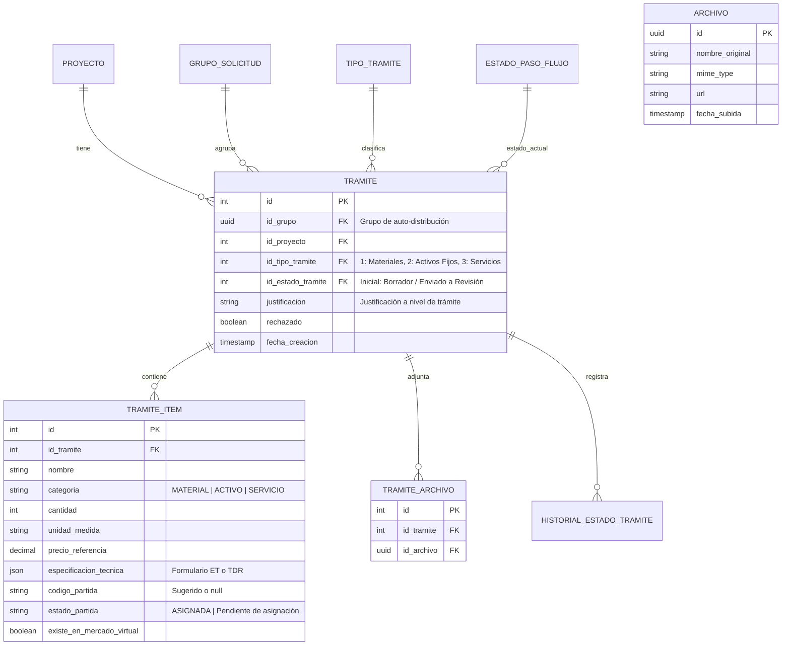
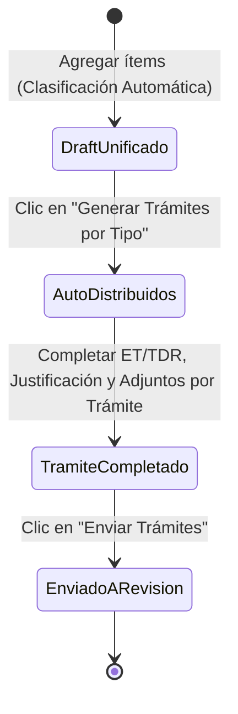

# Data Model: Registro y Auto-Distribución de Solicitud de Adquisición por Tipo

**Feature**: `001-registro-solicitud-lote`  
**Date**: 2026-07-23  

---

## Entities & Relationships Diagram (Conceptual)

---

## Detailed Entity Schemas

### 1. `grupo_solicitud` (Temporal/Contenedor de Sesión)
- `id` (UUID, Primary Key)
- `id_proyecto` (Integer, Foreign Key -> `proyecto.id`)
- `id_usuario_ip` (Integer, Foreign Key -> `usuario.id`)
- `fecha_creacion` (Timestamp)

### 2. `tramite`
- `id` (Serial, Primary Key)
- `id_grupo` (UUID, Nullable, Foreign Key -> `grupo_solicitud.id`)
- `id_proyecto` (Integer, Foreign Key -> `proyecto.id`)
- `id_tipo_tramite` (SmallInt, Foreign Key -> `tipo_tramite.id` [1: Compra menor material, 2: Compra menor activo fijo, 3: Compra menor servicios])
- `id_estado_tramite` (SmallInt, Foreign Key -> `estado_paso_flujo.id`)
- `justificacion` (Text, Nullable)
- `fecha_creacion` (Timestamp, Default NOW)
- `fecha_actualizacion` (Timestamp, Default NOW)
- `rechazado` (Boolean, Default false)

### 3. `tramite_item`
- `id` (Serial, Primary Key)
- `id_tramite` (Integer, Foreign Key -> `tramite.id`)
- `id_item` (Integer, Nullable, Foreign Key -> `item.id`)
- `nombre` (VARCHAR 255)
- `categoria` (VARCHAR 50) -> `"MATERIAL" | "ACTIVO" | "SERVICIO"`
- `cantidad` (Integer, Default 1)
- `unidad_medida` (VARCHAR 50, Default `"Unidad"`)
- `precio_referencia` (DECIMAL 15,2)
- `especificacion_tecnica` (JSONB) -> Contiene campos ET o TDR
- `codigo_partida` (VARCHAR 20, Nullable)
- `estado_partida` (VARCHAR 50) -> `"ASIGNADA" | "Pendiente de asignación"`
- `existe_en_mercado_virtual` (Boolean, Default true)

### 4. `archivo` & `tramite_archivo`
- `archivo.id` (UUID, Primary Key)
- `archivo.nombre_original` (VARCHAR 255)
- `archivo.mime_type` (VARCHAR 100)
- `archivo.url` (VARCHAR 512)
- `archivo.fecha_subida` (Timestamp)
- `tramite_archivo.id_tramite` (Integer, FK -> `tramite.id`)
- `tramite_archivo.id_archivo` (UUID, FK -> `archivo.id`)

---

## State Transition Rules

