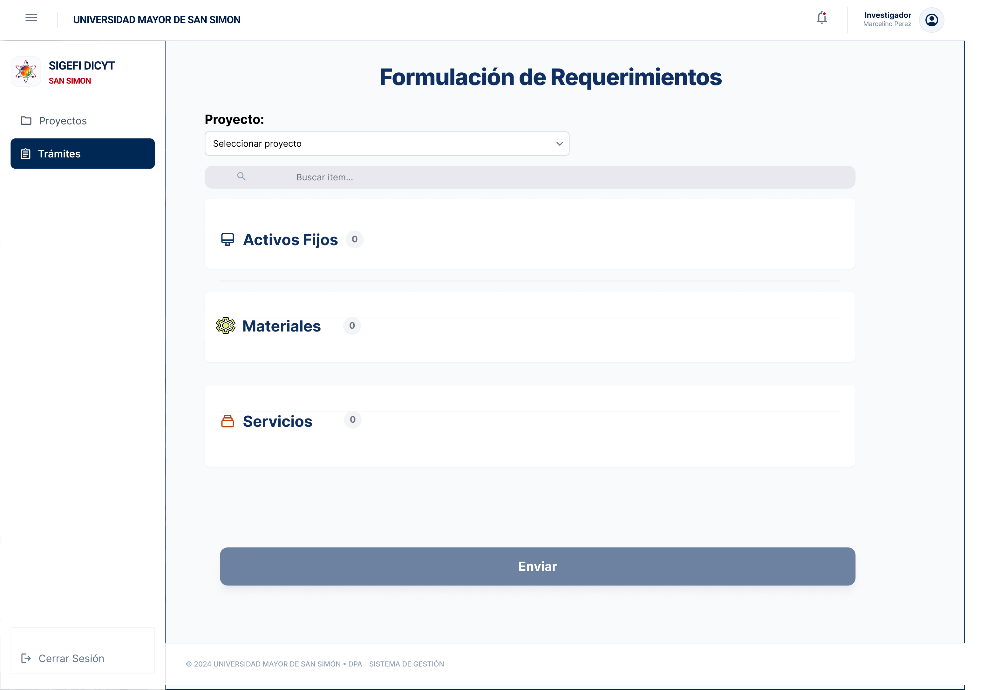
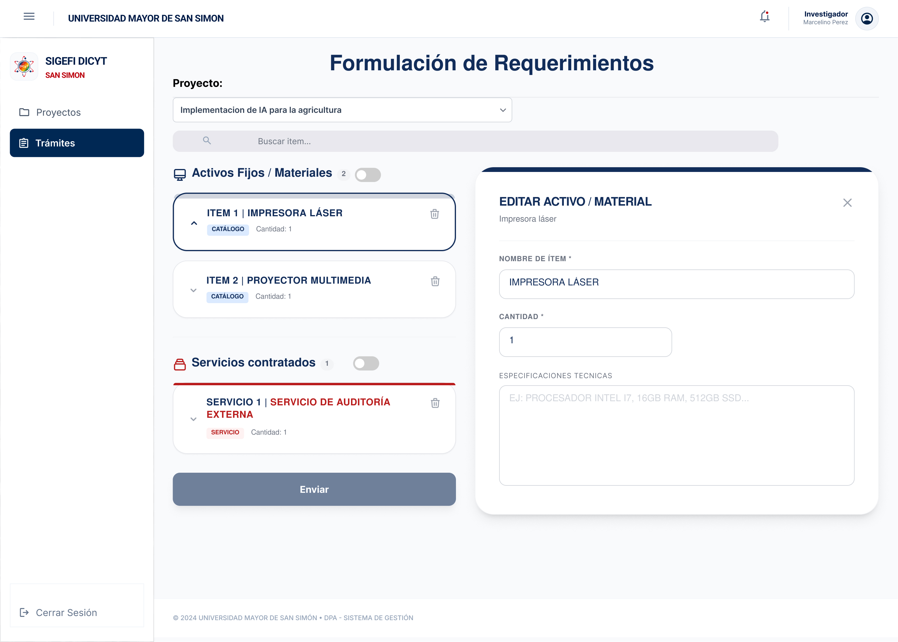

# Feature Specification: Creación y Envío de Trámites de Adquisición Divididos por Tipo de Compra

**Feature Branch**: `001-segregacion-tramites-lote`

**Created**: 2026-07-27

**Status**: Draft

**Input**: User description: "Formulación de Requerimientos con interfaz en español y diseño en panel lateral (sin modal modal flotante). Las categorías se generan dinámicamente solo al agregar ítems del tipo. Cada trámite tiene su justificación e información de cabecera independiente. Los campos del detalle del ítem inician totalmente EN BLANCO, la ET de bienes es texto, el TDR de servicios es PDF, las proformas aceptan imagen o PDF y el nombre del ítem es de solo lectura."

---

## User Scenarios & Testing *(mandatory)*

<!--
  MVP & TESTING NOTE: This project is an MVP for fast validation.
  Limit testing to essential, targeted unit tests ("pruebas unitarias bien puntuales") for critical core logic.
  DESIGN SYSTEM NOTE: All UI components strictly adhere to DESIGN.md and the official mockups (institutional UMSS colors Azul #002855 / #003770, Rojo #BC000C, componentes en español, diseño de barra lateral y cabecera institucional).
-->

### User Story 1 - Generación Dinámica de Trámites por Categoría (Priority: P1)

Como Investigador (ej. Marcelino Pérez), en la vista "Formulación de Requerimientos" (`/tramites/nuevo`), quiero buscar y agregar ítems, para que el sistema genere únicamente las tarjetas de trámite correspondientes a los tipos de ítems agregados (Activos Fijos, Materiales, Servicios), sin mostrar categorías vacías antes de tiempo.

**Mockup**: 

**Why this priority**: Evita saturación visual y mantiene la pantalla limpia para el usuario final.

**Independent Test**: Iniciar en `/tramites/nuevo` con 0 ítems. Agregar un Activo Fijo y verificar que solo aparece la tarjeta de Activos Fijos. Luego agregar un Servicio y comprobar que aparece únicamente la tarjeta de Servicios.

**Acceptance Scenarios**:

1. **Given** que el Investigador está en la pantalla de Formulación de Requerimientos con 0 ítems, **When** busca y selecciona un nuevo ítem, **Then** se genera dinámicamente únicamente la tarjeta de trámite correspondiente a esa categoría.
2. **Given** categorías sin ítems agregados, **When** el usuario visualiza la pantalla, **Then** NO se muestra ningún contenedor o bloque vacío.

---

### User Story 2 - Edición de Ítems en Panel Lateral (Campos en Blanco) (Priority: P1)

Como Investigador, al seleccionar un ítem para editar su detalle (ej. "EDITAR SERVICIO"), quiero ver un panel lateral integrado en la pantalla (sin ventana emergente modal) donde los campos (precio referencial, cantidad, justificación) inicien totalmente en blanco para completarlos durante la demostración, con el nombre del ítem en solo lectura.

**Mockup**: 

**Why this priority**: El flujo en panel lateral permite edición simultánea y fluida manteniendo visible la lista de requerimientos.

**Independent Test**: Seleccionar un ítem y verificar que se abra el panel lateral derecho con el campo de nombre inalterable y los campos de cantidad, precio y justificación limpios/en blanco.

**Acceptance Scenarios**:

1. **Given** un ítem en la lista, **When** el Investigador hace clic sobre él, **Then** se abre el panel lateral derecho "EDITAR SERVICIO" o "EDITAR REQUERIMIENTO".
2. **Given** los campos de cantidad, precio referencial y justificación/ET en el panel lateral, **When** se abre el formulario, **Then** los campos inician en blanco (vacíos) para que el usuario los ingrese.
3. **Given** un ítem de Material o Activo Fijo, **When** se edita en el panel lateral, **Then** las Especificaciones Técnicas (ET) se ingresan como un área de texto simple.
4. **Given** un ítem de Servicio, **When** se edita en el panel lateral, **Then** los Términos de Referencia (TDR) se adjuntan en formato PDF.

---

### User Story 3 - Cabecera e Información de Respaldo INDIVIDUAL por Trámite (Priority: P2)

Como Investigador, al configurar los datos generales de un trámite generado en pantalla, quiero ingresar la Justificación del Trámite particular y adjuntar proformas/cotizaciones de respaldo (en PDF o Imagen), especificando Custodio y Ubicación en trámites de Activos Fijos.

**Mockup**: 

**Why this priority**: Cada número de trámite administrativo posee su propio legajo, justificación y proformas independientes.

**Independent Test**: Verificar que cada tarjeta de trámite tenga su propia sección independiente de Justificación, Proformas (imagen o PDF) y Custodio.

**Acceptance Scenarios**:

1. **Given** una tarjeta de trámite generada en pantalla, **When** el Investigador configura su cabecera, **Then** puede ingresar el texto de Justificación del Trámite y adjuntar archivos de respaldo (PDF, PNG, JPG, WEBP) pertenecientes a dicho trámite.
2. **Given** un trámite de Activos Fijos, **When** se configura su cabecera, **Then** exige ingresar Nombre del Custodio y Ubicación.

---

### User Story 4 - Envío Individual por Trámite y Modal de Saldo Insuficiente (Priority: P2)

Como Investigador, deseo presionar el botón "Enviar Trámite" de un formulario particular para enviarlo de forma independiente, o visualizar el modal de "Saldo Insuficiente" si la partida excede el presupuesto disponible.

**Mockup**: 

**Why this priority**: Garantiza resiliencia en el envío y manejo adecuado del presupuesto.

**Independent Test**: Hacer clic en "Enviar Trámite" en un trámite completo y comprobar su envío independiente con código de seguimiento (`TR-2026-XXXX`).

**Acceptance Scenarios**:

1. **Given** un trámite con datos completos, **When** el Investigador presiona "Enviar Trámite", **Then** el sistema procesa únicamente esa solicitud y genera su código de seguimiento.
2. **Given** una partida sin saldo suficiente, **When** se intenta enviar, **Then** se despliega el modal "Saldo Insuficiente" con la opción de "Iniciar Modificación Presupuestaria".

---

## Requirements *(mandatory)*

### Functional Requirements

- **FR-001**: El sistema DEBE ofrecer una ruta principal limpia en el Home (`/`) que sirva de panel inicial institucional en español para el sistema SIGEFI DICYT UMSS.
- **FR-002**: El sistema DEBE proveer la ruta en español `/tramites` para la pantalla "Lista de Trámites", incluyendo la tabla de solicitudes, búsqueda por proyecto, filtro por tipo y botón "+ Crear trámite".
- **FR-003**: El sistema DEBE proveer la ruta en español `/tramites/nuevo` para la pantalla "Formulación de Requerimientos".
- **FR-004**: La pantalla "Formulación de Requerimientos" DEBE iniciar en estado totalmente VACÍO (0 trámites generados) y crear dinámicamente la tarjeta de trámite ÚNICAMENTE al agregar un ítem de dicho tipo (Activos Fijos, Materiales, Servicios).
- **FR-005**: La edición de detalles de un ítem DEBE realizarse mediante un **Panel Lateral Derecho integrado** (Side Panel), NO mediante una ventana emergente modal flotante.
- **FR-006**: Todos los campos editables del panel lateral (Precio Referencial, Cantidad, Justificación / ET Texto) DEBEN iniciar **TOTALMENTE EN BLANCO / VACÍOS** al agregar o seleccionar un ítem.
- **FR-007**: El campo "DETALLE / Nombre del Ítem" DEBE ser de solo lectura e inalterable (`readOnly disabled`).
- **FR-008**: Para ítems de "Materiales" y "Activos Fijos", las Especificaciones Técnicas (ET) DEBEN ser un área de texto simple. Para "Servicios", el TDR DEBE ser un archivo PDF adjunto.
- **FR-009**: Las proformas/cotizaciones de respaldo DEBEN aceptar archivos en formato de Imagen (`.png`, `.jpg`, `.jpeg`, `.webp`) y documentos PDF (`.pdf`).
- **FR-010**: Cada tarjeta de trámite DEBE tener su propia cabecera independiente con su texto de Justificación, sus proformas de respaldo y su botón de envío individual.
- **FR-011**: Si la partida no cuenta con saldo disponible, se DEBE mostrar el modal "Saldo Insuficiente" con el desglose de partida, monto requerido, saldo disponible y déficit.

---

## Success Criteria *(mandatory)*

### Measurable Outcomes

- **SC-001**: Las tarjetas de trámites no aparecen hasta que se agregue el primer ítem de esa categoría.
- **SC-002**: El panel lateral derecho reemplaza al modal y carga con los campos de entrada vacíos.
- **SC-003**: El 100% de las justificaciones y proformas están aisladas por cada trámite individual.

---

## Assumptions

- **Alineación con MVP**: Desarrollo optimizado para flujo fluido de demostración con usuario final.
- **Navegación e Idioma**: Estricto uso del idioma español en toda la interfaz y componentes.
