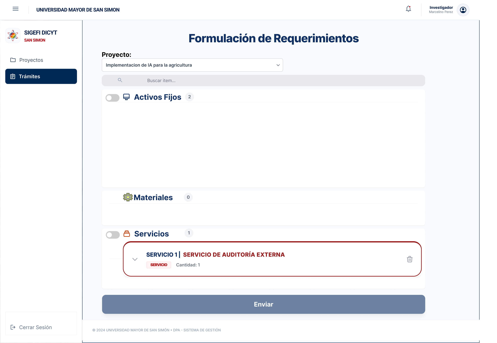
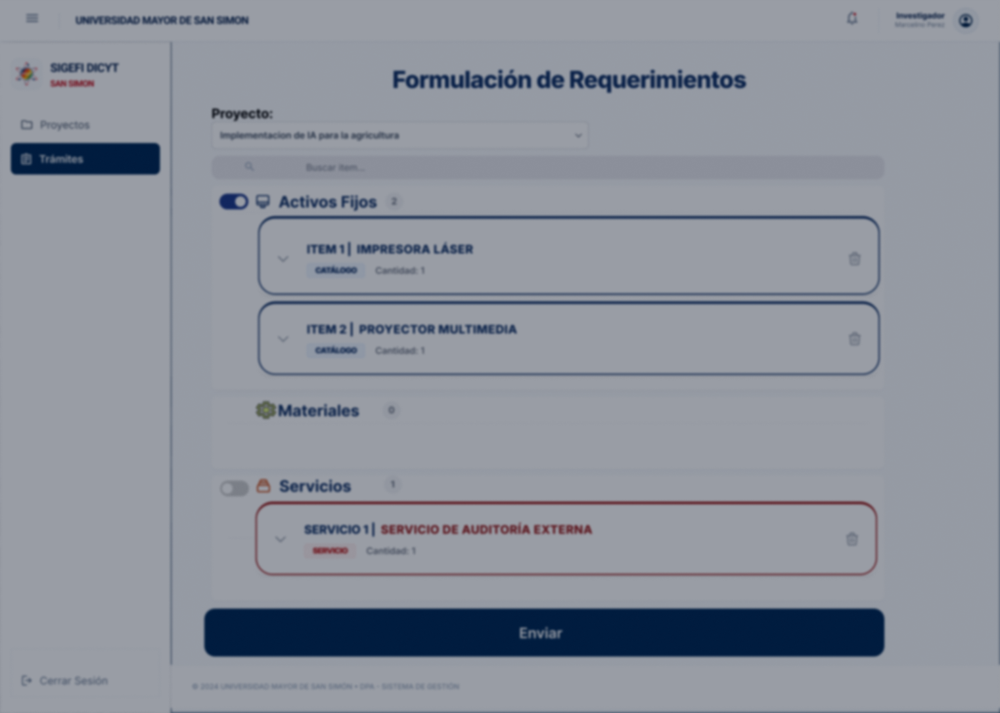
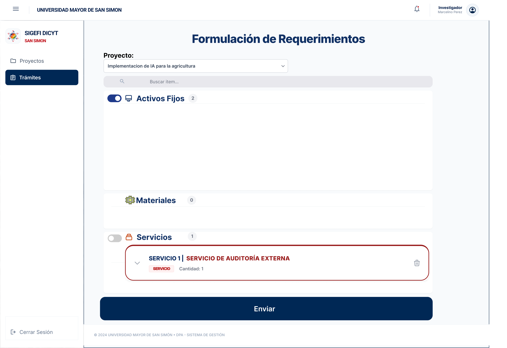
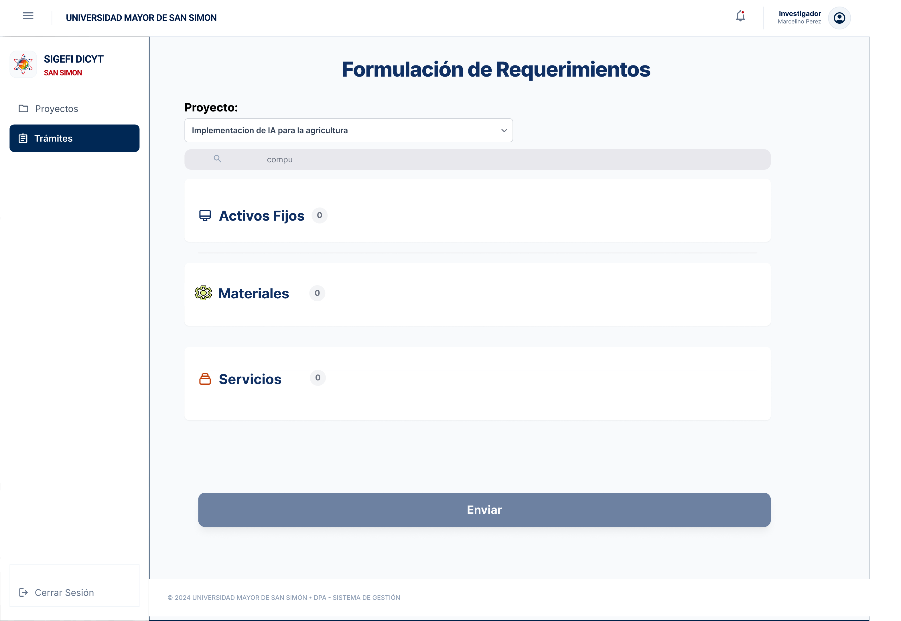
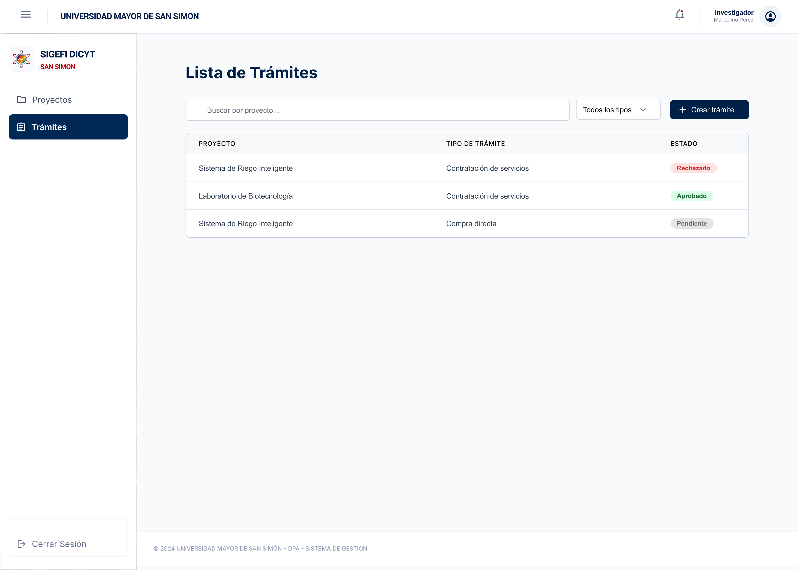

# Feature Specification: Creación y Envío de Trámites de Adquisición Divididos por Tipo de Compra

**Feature Branch**: `001-segregacion-tramites-lote`

**Created**: 2026-07-27

**Status**: Draft

**Input**: User description: "Creación y envío de trámites de adquisición divididos por tipo de compra. Formulación de Requerimientos con interfaz en español, segregación dinámica por categoría (se crea la sección solo cuando se agrega un ítem del tipo), justificación y respaldos individuales por trámite, envío individual por trámite y envío resiliente en lote."

---

## User Scenarios & Testing *(mandatory)*

<!--
  MVP & TESTING NOTE: This project is an MVP for fast validation.
  Limit testing to essential, targeted unit tests ("pruebas unitarias bien puntuales") for critical core logic.
  DESIGN SYSTEM NOTE: All UI components strictly adhere to DESIGN.md and the official mockups (institutional UMSS colors Azul #002855 / #003770, Rojo #BC000C, componentes en español, diseño de barra lateral y cabecera institucional).
-->

### User Story 1 - Formulación de Requerimientos y Generación Dinámica de Trámites por Categoría (Priority: P1)

Como Investigador (ej. Marcelino Pérez), en la vista "Formulación de Requerimientos" (`/tramites/nuevo`), quiero seleccionar mi proyecto y buscar/agregar ítems, para que se generen dinámicamente únicamente las tarjetas/secciones de los trámites pertenecientes a las categorías de los ítems agregados (Activos Fijos, Materiales, Servicios), sin mostrar tipos de trámite vacíos desde el principio.

**Mockup**: 

**Why this priority**: La segregación de requerimientos por categoría es obligatoria según la normativa universitaria de la UMSS, y la UI debe ser simple y limpia sin secciones vacías prematuras.

**Independent Test**: Iniciar en `/tramites/nuevo` en estado totalmente vacío (0 trámites creados en pantalla). Agregar un ítem de Activo Fijo y comprobar que solo se genera la tarjeta del Trámite de Activos Fijos. Luego agregar un Servicio y comprobar que se genera la tarjeta del Trámite de Servicios.

**Acceptance Scenarios**:

1. **Given** que el Investigador está en la pantalla de Formulación de Requerimientos con 0 ítems agregados, **When** busca y selecciona un nuevo ítem, **Then** el sistema auto-clasifica el ítem y genera dinámicamente la tarjeta/formulario de trámite correspondiente a esa categoría.
2. **Given** las categorías sin ítems agregados, **When** el usuario visualiza la pantalla, **Then** NO se muestran secciones ni borradores de trámites vacíos hasta que se agregue al menos un ítem de dicho tipo.

---

### User Story 2 - Registro de Información por Ítem y Carga de Documento Técnico (Priority: P1)

Como Investigador, al hacer clic sobre un ítem o expandir su detalle (ej. "SERVICIO 1 | SERVICIO DE AUDITORÍA EXTERNA"), quiero ver el modal u overlay con los campos requeridos (Cantidad, Precio, Detalle) y adjuntar el documento obligatorio (ET o TDR en PDF).

**Mockup**: 

**Why this priority**: Cada ítem requiere su especificación técnica (ET) o términos de referencia (TDR) antes de ser procesado por presupuestos y compras.

**Independent Test**: Abrir la tarjeta de un ítem, ingresar cantidad y adjuntar el PDF de ET/TDR, comprobando que se muestre el estado completado y el cálculo referencial.

**Acceptance Scenarios**:

1. **Given** un ítem en la lista de requerimientos de un trámite generado, **When** el Investigador edita su detalle, **Then** puede ingresar la cantidad, precio unitario o detalle de servicio y adjuntar el archivo ET (para Materiales/Activos Fijos) o TDR (para Servicios).
2. **Given** la consulta de partida presupuestaria de 5 dígitos del Objeto del Gasto, **When** se evalúa el ítem, **Then** se asigna el código específico más profundo del clasificador oficial.

---

### User Story 3 - Cabecera, Justificación y Documentos de Respaldo INDIVIDUALES por Trámite (Priority: P2)

Como Investigador, al configurar los datos generales de un trámite generado en pantalla, quiero ingresar el texto de Justificación del Trámite específico y adjuntar los archivos de respaldo (proformas/cotizaciones) independientes para ese trámite, además del Custodio y Ubicación si corresponde a Activos Fijos.

**Mockup**: 

**Why this priority**: Cada número de trámite administrativo representa una solicitud homogénea independiente con su propia justificación legal y respaldos.

**Independent Test**: Crear 2 trámites (uno de Activos Fijos y uno de Servicios) y verificar que cada uno tiene sus propios campos independientes de Justificación, Proformas de Respaldo y Custodio.

**Acceptance Scenarios**:

1. **Given** que el Investigador está configurando la cabecera de un trámite generado, **When** ingresa a los datos generales de dicho trámite, **Then** puede ingresar el texto de Justificación del Trámite y adjuntar uno o varios archivos PDF/imágenes de respaldo (proformas/cotizaciones).
2. **Given** un trámite generado de la categoría Activos Fijos, **When** se configura su cabecera, **Then** exige ingresar el Nombre del Custodio y Lugar de ubicación de forma obligatoria para esa solicitud específica.

---

### User Story 4 - Envío Individual de Trámites (Priority: P2)

Como Investigador, cuando haya completado los datos de un trámite específico, quiero presionar el botón "Enviar Trámite" de ese formulario particular, para que el sistema valide únicamente ese trámite, lo registre en el flujo de aprobación y emita su confirmación de envío exitoso sin afectar a los demás trámites.

**Mockup**: 

**Why this priority**: Permite enviar trámites listos de forma inmediata sin que un trámite incompleto bloquee el envío de los demás.

**Independent Test**: Teniendo un trámite de Materiales completo y uno de Servicios incompleto, presionar "Enviar Trámite" únicamente en el formulario del trámite de Materiales. Verificar que solo el de Materiales se envía y emite su código de seguimiento (`TR-2026-XXXX`).

**Acceptance Scenarios**:

1. **Given** que el Investigador ha completado los datos de un trámite específico, **When** presiona el botón "Enviar Trámite" de ese formulario particular, **Then** el sistema valida únicamente ese trámite, lo registra en el flujo de aprobación y emite una confirmación de envío exitoso con su código de seguimiento.

---

### User Story 5 - Envío en Lote Resiliente (Envío Múltiple con Manejo de Errores) (Priority: P3)

Como Investigador, cuando tenga 2 o más trámites generados en pantalla y presione el botón "Enviar Todos los Trámites", quiero que el sistema procese el envío de cada trámite de forma independiente, enviando los válidos con éxito e identificando los incompletos resaltando sus errores.

**Mockup**: 

**Why this priority**: Proporciona resiliencia total y retroalimentación clara en envíos masivos.

**Independent Test**: Tener 2 trámites generados (uno válido y uno sin Justificación). Presionar "Enviar Todos los Trámites". Verificar que el válido se envíe emitiendo su número de seguimiento, mientras el inválido se mantiene en borrador resaltando el campo "Falta Justificación" en rojo.

**Acceptance Scenarios**:

1. **Given** que el Investigador tiene 2 o más trámites generados en pantalla, **When** presiona el botón "Enviar Todos los Trámites", **Then** el sistema procesa el envío de cada trámite de forma independiente:
   - **Para los trámites válidos**: Se envían correctamente y el sistema notifica su éxito mostrando su número de seguimiento.
   - **Para los trámites con errores o datos faltantes**: Se mantienen en pantalla en estado borrador y el sistema destaca visualmente el error específico indicando qué campo o documento debe corregirse para reintentar su envío.

---

## Requirements *(mandatory)*

### Functional Requirements

- **FR-001**: El sistema DEBE ofrecer una ruta principal limpia en el Home (`/`) que sirva de panel inicial institucional en español para el sistema SIGEFI DICYT UMSS.
- **FR-002**: El sistema DEBE proveer la ruta en español `/tramites` para la pantalla "Lista de Trámites", incluyendo la tabla de solicitudes, búsqueda por proyecto, filtro por tipo y botón "+ Crear trámite".
- **FR-003**: El sistema DEBE proveer la ruta en español `/tramites/nuevo` para la pantalla "Formulación de Requerimientos".
- **FR-004**: La pantalla "Formulación de Requerimientos" DEBE iniciar en estado totalmente VACÍO (0 trámites generados).
- **FR-005**: El sistema DEBE crear/generar dinámicamente la tarjeta/formulario de un trámite ÚNICAMENTE cuando el usuario agregue al menos un ítem perteneciente a dicha categoría (Activos Fijos, Materiales o Servicios). NO se deben mostrar contenedores de categorías vacías antes de agregar ítems.
- **FR-006**: Cada trámite generado en pantalla DEBE poseer su propia cabecera independiente con su campo de Justificación del Trámite y su cargador de archivos de respaldo (proformas/cotizaciones).
- **FR-007**: Los trámites de la categoría Activos Fijos DEBEN incluir obligatoriamente sus propios campos de Nombre del Custodio y Lugar/Laboratorio de ubicación en su cabecera particular.
- **FR-008**: Cada tarjeta de trámite generado DEBE incluir su propio botón "Enviar Trámite" para permitir el envío individual independiente de esa solicitud específica.
- **FR-009**: Cuando existan 2 o más trámites generados en pantalla, el sistema DEBE habilitar el botón masivo "Enviar Todos los Trámites".
- **FR-010**: El procesamiento masivo de "Enviar Todos los Trámites" DEBE ser resiliente non-blocking (`Promise.allSettled`), enviando con éxito los trámites válidos (otorgando código de seguimiento) y manteniendo en borrador los trámites con errores o faltantes resaltando en rojo los campos a corregir.
- **FR-011**: Las partidas del Objeto del Gasto asignadas a los ítems DEBEN utilizar obligatoriamente el código de 5 dígitos de nivel más profundo según el Clasificador oficial de Bolivia (ej. `34200` Productos Químicos, `43400` Equipo de Laboratorio, `43120` Equipo de Computación, `25230` Auditorías Externas, `39500` Útiles de Escritorio).
- **FR-012**: Toda la interfaz DEBE mantener el marco institucional UMSS (Sidebar fijo con logo SIGEFI DICYT, Topbar con perfil de Investigador y pie de página en español).

---

## Success Criteria *(mandatory)*

### Measurable Outcomes

- **SC-001**: La interfaz inicial en `/tramites/nuevo` no muestra ninguna tarjeta ni sección vacía de trámite hasta que el usuario agrega su primer ítem.
- **SC-002**: El 100% de los trámites generados cuentan con su cabecera, justificación y proformas aisladas e independientes de otros trámites.
- **SC-003**: El envío individual valida y procesa únicamente el trámite seleccionado en < 500ms sin alterar el estado de otros trámites en borrador.
- **SC-004**: En el envío masivo, un trámite con errores jamás bloquea el envío exitoso de los trámites válidos en el mismo lote.

---

## Assumptions

- **Alineación con MVP**: Lógica de estado y validación local de alta reactividad, apoyada en Supabase Storage para adjuntos.
- **Navegación e Idioma**: Estricto uso del idioma español en todas las pantallas y mensajes del sistema.
