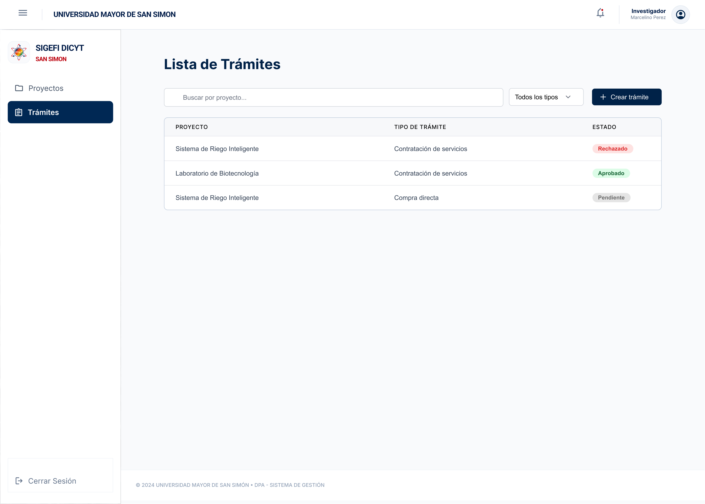

# Feature Specification: Bandeja Consolidada y Seguimiento de Trámites con Filtrado

**Feature Branch**: `002-bandeja-consolidada-tramites`

**Created**: 2026-07-27

**Status**: Draft

**Input**: User description: "Bandeja consolidada y seguimiento de trámites con filtrado para el Investigador Principal. Visualización centralizada de todos los trámites (compras, fondos rotatorios, modificaciones presupuestarias, servicios, activos fijos), paso actual dinámico (Paso X/Y), estado de acción pendiente (ATENDER vs VER DETALLE), filtros multi-criterio (Búsqueda, Tipo, Proyecto, Paso) y paginación."

---

## User Scenarios & Testing *(mandatory)*

<!--
  MVP & TESTING NOTE: This project is an MVP for fast validation.
  Limit testing to essential, targeted unit tests ("pruebas unitarias bien puntuales") for critical core logic.
  DESIGN SYSTEM NOTE: All UI components strictly adhere to DESIGN.md and the official mockup (institutional UMSS colors Azul #002855 / #003770, Rojo #BC000C, badges de estado dinámicos, botones ATENDER y VER DETALLE).
-->

### User Story 1 - Visualización Consolidada Unificada de Trámites (Priority: P1) 🎯 MVP

Como Investigador Principal (Unidad Solicitante), quiero acceder a una bandeja centralizada en `/tramites` que me liste todos mis trámites iniciados o en los que participo (compras de materiales, servicios, activos fijos, fondos rotatorios, modificaciones presupuestarias), ordenados por fecha de creación (más recientes primero).

**Mockup**: 

**Why this priority**: Permite al investigador dar un seguimiento centralizado y oportuno a todos los procesos sin tener que consultar cada módulo por separado.

**Independent Test**: Ingresar a `/tramites` y verificar que la tabla renderice trámites de distintas categorías con las columnas `Nº`, `PROYECTO`, `TIPO DE TRÁMITE`, `FECHA`, `PASO ACTUAL`, `CREADOR` y `ACCIÓN`.

**Acceptance Scenarios**:

1. **Given** que el Investigador Principal ingresa al módulo de Trámites, **When** carga la vista `/tramites`, **Then** visualiza el listado unificado de trámites ordenados del más reciente al más antiguo.
2. **Given** la tabla de trámites, **When** se renderiza cada registro, **Then** muestra el Nro del trámite (`01`, `02`), Nombre del Proyecto en negrita, Tipo de Trámite, Fecha de creación (`15 Oct 2023`), Paso Actual dinámico, Nombre del Creador y Botón de Acción.

---

### User Story 2 - Buscador y Filtrado Multi-criterio (Priority: P1)

Como Investigador Principal, quiero filtrar los trámites por texto libre (código o proyecto), por tipo de trámite, por proyecto específico y por paso actual, con opción de restablecer los filtros.

**Mockup**: 

**Why this priority**: Es indispensable para encontrar rápidamente solicitudes específicas entre decenas de trámites activos de investigación.

**Independent Test**: Seleccionar un tipo de trámite en el filtro "Tipo de Trámite" o escribir un código en "BUSCAR" y verificar que la tabla filtre instantáneamente los registros coincidentes.

**Acceptance Scenarios**:

1. **Given** la barra de filtros superiores, **When** el usuario escribe en "BUSCAR" (código o proyecto), **Then** la tabla filtra en tiempo real los registros que coincidan con el texto.
2. **Given** los selectores desplegables de "TIPO DE TRÁMITE", "PROYECTO" y "PASO ACTUAL", **When** el usuario selecciona un criterio específico, **Then** se actualiza la lista mostrando únicamente los trámites que satisfacen los filtros aplicados.
3. **Given** filtros activos aplicados, **When** el usuario limpia los filtros, **Then** se restablece la vista por defecto con todos los trámites.

---

### User Story 3 - Indicador Visual de Avance Dinámico y Acción Pendiente (Priority: P2)

Como Investigador Principal, quiero que la columna "Paso Actual" muestre una etiqueta de progreso adaptativa (ej. `Paso 1/4: Solicitud`, `Paso 2/4: Recepción de Material`, `Paso 4/4: Completado`) y que la columna "Acción" identifique si me corresponde actuar (`ATENDER` en azul) o solo revisar (`VER DETALLE`).

**Mockup**: 

**Why this priority**: Otorga claridad visual inmediata sobre en qué etapa se encuentra cada solicitud y qué trámites requieren intervención inmediata del usuario.

**Independent Test**: Verificar que un trámite con tarea pendiente muestre el botón azul `ATENDER`, mientras que un trámite en revisión por terceros u homologado muestre el botón `VER DETALLE`.

**Acceptance Scenarios**:

1. **Given** un trámite en la lista, **When** el sistema calcula su avance, **Then** renderiza la etiqueta del paso actual con su número de etapa (`Paso X/Y`), nombre del paso y badge cromático según su estado (naranja para en proceso, verde para completado).
2. **Given** un trámite que requiere acción del usuario actual, **When** se renderiza la columna "ACCIÓN", **Then** muestra el botón principal destacado **`ATENDER`** (color azul `#002855`).
3. **Given** un trámite que no requiere acción directa del usuario actual, **When** se renderiza la columna "ACCIÓN", **Then** muestra el botón secundario **`VER DETALLE`**.

---

### User Story 4 - Paginación y Estado Vacío (Priority: P3)

Como Investigador Principal, quiero contar con paginación fluida (ej. 10, 20 o 50 registros) y visualizar una pantalla informativa clara cuando no existan trámites o ningún registro coincida con la búsqueda.

**Mockup**: 

**Why this priority**: Asegura un rendimiento óptimo de carga y excelente experiencia de usuario cuando no hay datos.

**Independent Test**: Aplicar un filtro que no arroje resultados y verificar que aparezca la ilustración y mensaje de estado vacío (Empty State).

**Acceptance Scenarios**:

1. **Given** una lista con múltiples registros, **When** el usuario navega en el pie de tabla, **Then** muestra la información de conteo (`Mostrando 1-4 de 24 trámites`) y permite avanzar o retroceder páginas con los controles `<` y `>`.
2. **Given** una búsqueda sin coincidencias o una cuenta sin trámites, **When** la lista queda en cero resultados, **Then** se despliega una ilustración con mensaje de Estado Vacío en español.

---

## Requirements *(mandatory)*

### Functional Requirements

- **FR-001**: El sistema DEBE ofrecer una vista consolidada unificada en la ruta en español `/tramites` que consuma un servicio abstracto de trámites (capaz de procesar solicitudes de Materiales, Servicios, Activos Fijos, Fondos Rotatorios y Modificaciones Presupuestarias).
- **FR-002**: Cada fila de la tabla DEBE mostrar las columnas: `Nº` (código/secuencial), `PROYECTO` (en negrita), `TIPO DE TRÁMITE`, `FECHA` (formato `DD Mes YYYY`), `PASO ACTUAL` (badge de avance), `CREADOR` y `ACCIÓN`.
- **FR-003**: El botón superior derecho DEBE permitir iniciar un nuevo trámite con la etiqueta `+ Agregar trámite` en color azul institucional (`#002855`), redirigiendo a `/tramites/nuevo`.
- **FR-004**: El filtro multi-criterio DEBE incluir:
  - Campo de texto "BUSCAR" (búsqueda libre por proyecto o código).
  - Selector desplegable "TIPO DE TRÁMITE".
  - Selector desplegable "PROYECTO".
  - Selector desplegable "PASO ACTUAL".
- **FR-005**: La columna "PASO ACTUAL" DEBE resolver dinámicamente el paso del flujo asignado a cada tipo de trámite con la estructura `Paso X/Y: Nombre del Paso` y color de badge según el avance (naranja en revisión, verde completado).
- **FR-006**: Si el trámite requiere intervención activa del usuario logueado, la columna "ACCIÓN" DEBE mostrar el botón primario `ATENDER` (azul `#002855`). Si no requiere intervención, DEBE mostrar el botón secundario `VER DETALLE`.
- **FR-007**: Hacer clic en la fila o en el botón de acción DEBE navegar a la vista de detalle correspondiente (`/tramites/[id]`).
- **FR-008**: El pie de tabla DEBE incluir el contador de registros (ej. `Mostrando 1-4 de 24 trámites`) y controles de paginación `<` `>`.
- **FR-009**: Cuando el número de registros filtrados sea cero (`0`), la pantalla DEBE mostrar el estado vacío (Empty State) con título, mensaje informativo en español y botón para limpiar filtros o crear trámite.

---

## Success Criteria *(mandatory)*

### Measurable Outcomes

- **SC-001**: La tabla consolidada carga y renderiza todos los tipos de trámites sin importar su categoría en < 300ms.
- **SC-002**: Los filtros multi-criterio (búsqueda, tipo, proyecto, paso) responden instantáneamente al usuario.
- **SC-003**: El 100% de los trámites identifican correctamente la necesidad de acción propia con el botón `ATENDER` vs `VER DETALLE`.

---

## Assumptions

- **Alineación con MVP**: Datos locales consolidados para la demo con respaldo de backend Supabase.
- **Diseño e Identidad**: Respeto estricto del mockup oficial `lista_tramites.jpg` y paleta de colores de `DESIGN.md`.
