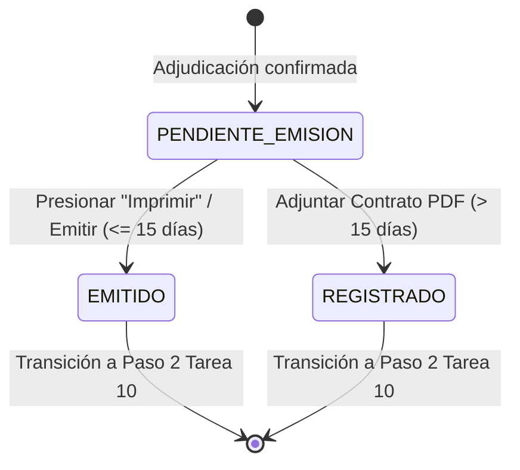

# Data Model: Generación y Emisión de Órdenes de Compra, Órdenes de Servicio o Contratos

**Feature**: `009-emision-ordenes-contratos`
**Date**: 2026-07-29

## Database Entities (Supabase / Postgres)

### 1. `orden_contractual`

Representa la orden de compra, orden de servicio o contrato formal generado para un proveedor en un trámite específico.

| Campo                  | Tipo            | Nulable | Descripción                                               |
| ---------------------- | --------------- | ------- | --------------------------------------------------------- |
| `id`                   | `integer` (PK)  | No      | Identificador único secuencial                            |
| `id_tramite`           | `integer` (FK)  | No      | Referencia al trámite (`tramite.id`)                      |
| `id_proveedor`         | `smallint` (FK) | No      | Referencia al proveedor adjudicado (`proveedor.id`)       |
| `tipo_documento`       | `varchar(30)`   | No      | `'ORDEN_COMPRA'`, `'ORDEN_SERVICIO'`, `'CONTRATO'`        |
| `numero_correlativo`   | `varchar(30)`   | Sí      | Correlativo asignado (ej. `"231"` o `"OC-2026-0231"`)     |
| `fecha_emision`        | `timestamp`     | No      | Fecha y hora de emisión del documento                     |
| `dias_entrega`         | `smallint`      | No      | Días calendario cotizados por el proveedor                |
| `fecha_limite_entrega` | `timestamp`     | No      | Fecha límite calculada según regla de bienes/servicios    |
| `monto_total`          | `numeric(12,2)` | No      | Sumatoria total de los ítems adjudicados                  |
| `monto_literal`        | `text`          | No      | Texto en palabras ("SON: OCHO MIL ... 00/100 BOLIVIANOS") |
| `estado`               | `varchar(30)`   | No      | `'PENDIENTE_EMISION'`, `'EMITIDO'`, `'REGISTRADO'`        |
| `pdf_contrato_url`     | `text`          | Sí      | URL del PDF subido escaneado (cuando plazo > 15 días)     |

### 2. `detalle_orden_contractual`

Representa las líneas de ítem incluidas dentro de cada orden contractual emitida.

| Campo                  | Tipo            | Nulable | Descripción                          |
| ---------------------- | --------------- | ------- | ------------------------------------ |
| `id`                   | `integer` (PK)  | No      | Identificador único del detalle      |
| `id_orden_contractual` | `integer` (FK)  | No      | Referencia a `orden_contractual.id`  |
| `id_item_tramite`      | `integer` (FK)  | No      | Referencia al ítem del trámite       |
| `cantidad`             | `smallint`      | No      | Cantidad adjudicada al proveedor     |
| `unidad`               | `varchar(30)`   | No      | Unidad de medida                     |
| `detalle`              | `text`          | No      | Descripción técnica con marca/modelo |
| `precio_unitario`      | `numeric(10,2)` | No      | Precio unitario cotizado             |
| `subtotal`             | `numeric(12,2)` | No      | `cantidad * precio_unitario`         |

---

## State Transitions

