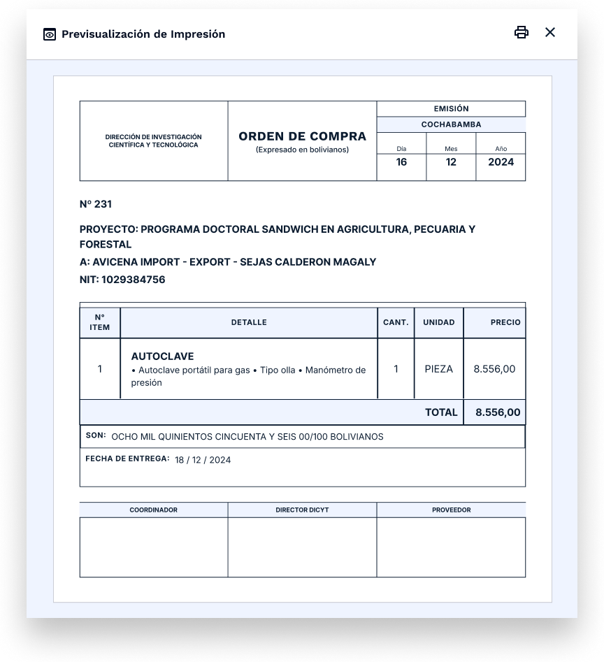
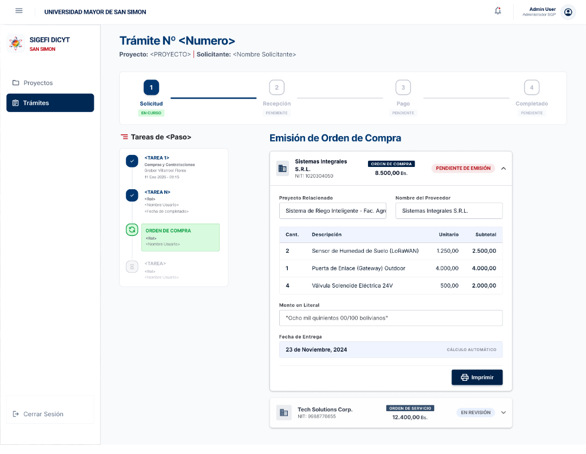

# Feature Specification: Generación y Emisión de Órdenes de Compra, Órdenes de Servicio o Contratos

**Feature Branch**: `009-emision-ordenes-contratos`

**Created**: 2026-07-29

**Status**: Draft

**Input**: User description: "Generación y emisión de Órdenes de Compra, Órdenes de Servicio o Contratos por el Responsable de Compras (Grover) a partir de los datos de la adjudicación previa para cada proveedor seleccionado, calculando las fechas límite de entrega correspondientes, asignando el correlativo y formalizando el compromiso legal."

## User Scenarios & Testing _(mandatory)_

### User Story 1 - Emisión Automática de Órdenes de Compra y Servicio (Plazo ≤ 15 días) (Priority: P1)

Como Responsable de Compras (Grover), quiero que el sistema genere automáticamente el documento contractual correspondiente (Orden de Compra u Orden de Servicio) de forma independiente por cada proveedor adjudicado cuando el plazo de entrega cotizado sea menor o igual a 15 días calendario, pre-llenando todos los ítems, montos, conversión literal y calculando la fecha límite de entrega para formalizar el trámite.

**Mockup**: 

**Why this priority**: Es la funcionalidad principal del Responsable de Compras para formalizar los pedidos adjudicados de entrega rápida (≤ 15 días), evitando el rellenado manual de datos y errores en el cálculo de plazos.

**Independent Test**: Seleccionar un trámite adjudicado a uno o varios proveedores con plazo de entrega ≤ 15 días y verificar que el sistema genera automáticamente un acordeón por proveedor con la lista exacta de ítems adjudicados, el monto en número, el monto convertido a palabras en formato UMSS ("SON: ...") y la fecha límite calculada según la regla de bienes o servicios.

**Acceptance Scenarios**:

1. **Given** un trámite con adjudicación confirmada a 1 o más proveedores para ítems de bienes (Materiales o Activos Fijos) con plazo de entrega ≤ 15 días, **When** el Responsable de Compras visualiza la tarea "Emisión de Orden de Compra", **Then** el sistema despliega un acordeón por proveedor adjudicado clasificando el documento como "ORDEN DE COMPRA", pre-llenando el nombre del proyecto, razón social, NIT del proveedor, tabla de ítems adjudicados con sus precios unitarios y subtotales.
2. **Given** una Orden de Compra para Bienes (Materiales/Activos Fijos), **When** se calcula la fecha límite de entrega, **Then** el sistema suma los días de entrega cotizados a partir del día SIGUIENTE a la fecha de emisión (Ejemplo: Emisión 20/11/2024 + 3 días = Fecha Límite 23/11/2024).
3. **Given** una Orden de Servicio para ítems de categoría Servicio con plazo ≤ 15 días, **When** el sistema determina el documento y la fecha límite, **Then** clasifica la tarjeta como "ORDEN DE SERVICIO" y calcula la fecha límite sumando los días de ejecución INCLUYENDO la misma fecha de emisión (Ejemplo: Emisión 20/11/2024 + 3 días = Fecha Límite 22/11/2024).
4. **Given** cualquier orden generada, **When** se despliega el resumen del monto total, **Then** el sistema convierte automáticamente la cifra decimal a texto literal en el formato oficial de la UMSS (ej. `"Ocho mil quinientos cincuenta y seis 00/100 bolivianos"`).

---

### User Story 2 - Previsualización de Impresión Oficial y Asignación de Correlativo (Priority: P2)

Como Responsable de Compras o Autoridad de la DICyT, quiero abrir un modal de previsualización de impresión oficial en formato físico institucional de la UMSS / DICyT para revisar la Orden de Compra/Servicio con su número correlativo asignado, desglose de ítems, fecha de emisión en formato Día/Mes/Año y los espacios oficiales para firmas del Coordinador del Proyecto, Director DICyT y Proveedor.

**Mockup**: 

**Why this priority**: Es indispensable para la impresión física del documento legal que se adjunta al expediente y firma en físico.

**Independent Test**: Hacer clic en el botón "Imprimir" dentro de cualquier Orden de Compra o Servicio generada y verificar la apertura del modal con el diseño oficial membretado de la UMSS / DICyT, fecha desglosada en Día/Mes/Año, tabla de ítems formateada, monto literal "SON: ..." y 3 bloques de firma.

**Acceptance Scenarios**:

1. **Given** una Orden de Compra o Servicio generada en pantalla, **When** el usuario presiona el botón "Imprimir", **Then** se abre el modal de previsualización de impresión mostrando la plantilla oficial con encabezado "DIRECCIÓN DE INVESTIGACIÓN CIENTÍFICA Y TECNOLÓGICA", título "ORDEN DE COMPRA" (o "ORDEN DE SERVICIO"), caja de fecha de emisión dividida en columnas Día, Mes y Año, número correlativo oficial (ej. "N° 231"), proyecto, proveedor y NIT.
2. **Given** el modal de previsualización cargado, **When** se renderiza la tabla de detalles, **Then** se muestra la columna N° Ítem, Detalle (nombre e ítem especifico con marca/modelo), Cantidad, Unidad, Precio y Total en bolivianos, seguido de la fila de TOTAL, el monto en letras "SON: ..." y la Fecha de Entrega en formato DD / MM / AAAA.
3. **Given** la parte inferior del documento de impresión, **When** se revisan los bloques de validación, **Then** se incluyen exactamente 3 recuadros de firma: "COORDINADOR", "DIRECTOR DICYT" y "PROVEEDOR".
4. **Given** la emisión por primera vez de una orden, **When** se confirma o imprime, **Then** el sistema asigna el siguiente número correlativo de la secuencia institucional.

---

### User Story 3 - Formalización y Adjuntado de Contratos para Plazos Mayores a 15 Días (Priority: P3)

Como Responsable de Compras, cuando el plazo de entrega o ejecución adjudicado a un proveedor sea mayor a 15 días calendario (> 15 días), quiero que el sistema requiera la elaboración de un Contrato formal derivado a Asesoría Legal y me permita adjuntar el archivo PDF escaneado del contrato firmado para respaldar el compromiso legal.

**Mockup**: 

**Why this priority**: Garantiza el cumplimiento normativo legal para adquisiciones o servicios de largo plazo (> 15 días) donde una simple Orden de Compra no es suficiente y se exige contrato formal.

**Independent Test**: Adjudicar un ítem a un proveedor con plazo de entrega de 20 días calendario y verificar que el tipo de documento cambia automáticamente a "CONTRATO", muestra una alerta requerida de Asesoría Legal y habilita el componente para subir el archivo PDF del contrato firmado.

**Acceptance Scenarios**:

1. **Given** un proveedor adjudicado cuyo plazo de entrega cotizado es mayor a 15 días calendario (> 15 días), **When** se visualiza su tarjeta en la tarea de emisión, **Then** el sistema clasifica el compromiso como "CONTRATO", muestra la alerta "Requiere elaboración de contrato por Asesoría Legal (> 15 días de plazo)" y habilita el botón para subir el documento PDF.
2. **Given** la tarjeta de Contrato en estado pendiente, **When** el Responsable de Compras selecciona y sube el archivo PDF del contrato firmado, **Then** el sistema almacena el archivo en el expediente digital del trámite y actualiza el estado del documento a "CONTRATO REGISTRADO".

---

### Edge Cases

- **¿Qué sucede si en un mismo trámite hay adjudicaciones a 2 proveedores distintos, uno con 5 días (Orden de Compra) y otro con 20 días (Contrato)?**: El sistema genera 2 acordeones independientes: el primero como "ORDEN DE COMPRA" (plazo ≤ 15 días) e imprimible, y el segundo como "CONTRATO" (plazo > 15 días) solicitando subida de PDF.
- **¿Cómo se manejan los cambios de mes o año en el cálculo automático de la fecha límite?**: La suma de días calendario utiliza funciones nativas de fecha que contemplan bisiestos y transiciones de mes/año (ej. Emisión 29/12/2024 + 5 días = Fecha Límite 03/01/2025).
- **¿Qué ocurre si el monto en bolivianos no tiene centavos?**: La conversión a texto literal incluye siempre la fracción `00/100 BOLIVIANOS` (ej. `8.556,00 Bs.` $\rightarrow$ `"OCHO MIL QUINIENTOS CINCUENTA Y SEIS 00/100 BOLIVIANOS"`).

## Requirements _(mandatory)_

### Functional Requirements

- **FR-001**: El sistema DEBE generar un registro contractual independiente (Orden de Compra, Orden de Servicio o Contrato) por cada proveedor adjudicado en el trámite.
- **FR-002**: El sistema DEBE clasificar automáticamente el tipo de documento según la categoría del ítem y el plazo cotizado:
  - Bienes (Materiales o Activos Fijos) con plazo $\le 15$ días calendario $\rightarrow$ **ORDEN DE COMPRA**
  - Servicios con plazo $\le 15$ días calendario $\rightarrow$ **ORDEN DE SERVICIO**
  - Bienes o Servicios con plazo $> 15$ días calendario $\rightarrow$ **CONTRATO**
- **FR-003**: El sistema DEBE calcular automáticamente la Fecha Límite de Entrega/Conclusión:
  - **Para Órdenes de Compra (Bienes)**: Sumando los días calendario a partir del día siguiente a la fecha de emisión.
  - **Para Órdenes de Servicio**: Sumando los días calendario incluyendo la fecha de emisión.
- **FR-004**: El sistema DEBE convertir automáticamente el monto total numérico en bolivianos a su expresión literal en palabras con la fracción `XX/100 BOLIVIANOS` en mayúsculas o formato oficial de la UMSS.
- **FR-005**: El sistema DEBE asignar y mantener la numeración correlativa secuencial de las órdenes de compra/servicio emitidas.
- **FR-006**: El sistema DEBE proporcionar un modal de previsualización e impresión que renderice la plantilla oficial membretada de la UMSS / DICyT con desglose de ítems, fecha dividida en Día/Mes/Año, monto literal "SON: ..." y los recuadros de firma para Coordinador, Director DICyT y Proveedor.
- **FR-007**: El sistema DEBE requerir la carga de un archivo PDF firmado cuando el tipo de documento sea "CONTRATO" (> 15 días de plazo).

### Key Entities

- **OrdenContractual**: Registro de la orden o contrato emitida por proveedor (`id`, `id_tramite`, `id_proveedor`, `tipo_documento` [ORDEN_COMPRA | ORDEN_SERVICIO | CONTRATO], `numero_correlativo`, `fecha_emision`, `dias_entrega`, `fecha_limite_entrega`, `monto_total`, `monto_literal`, `estado` [PENDIENTE_EMISION | EMITIDO | REGISTRADO], `pdf_contrato_url`).
- **DetalleOrdenContractual**: Ítems incluidos en cada orden (`id`, `id_orden_contractual`, `id_item_tramite`, `cantidad`, `unidad`, `detalle`, `marca_modelo`, `precio_unitario`, `subtotal`).

## Success Criteria _(mandatory)_

### Measurable Outcomes

- **SC-001**: El 100% de los proveedores adjudicados en un trámite cuentan con su documento contractual generado automáticamente sin necesidad de reescribir manualmente los ítems ni los montos.
- **SC-002**: Precisión del 100% en el cálculo de la fecha límite de entrega diferenciando adecuadamente la regla de bienes (día siguiente) frente a la de servicios (mismo día).
- **SC-003**: El modal de previsualización e impresión abre en menos de 1 segundo desplegando el formato oficial con diseño identico al estándar impreso de la UMSS / DICyT.

## Assumptions

- Los días de entrega se obtienen directamente de la cotización ganadora seleccionada en la etapa previa de adjudicación.
- El formato literal sigue las convenciones bancarias y administrativas oficiales de Bolivia (`XX/100 BOLIVIANOS`).
- La firma física posterior de los documentos se realiza sobre la hoja impresa del sistema o mediante el contrato PDF escaneado subido al expediente digital.
