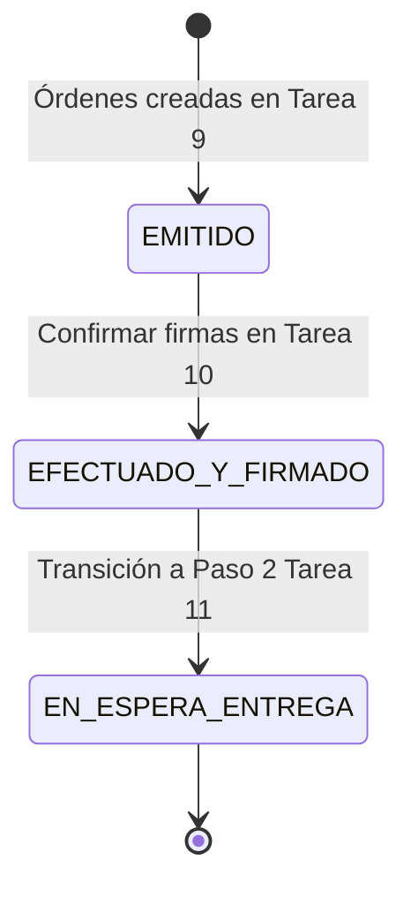

# Data Model: Efectivización y Firma de Documentos Contractuales

**Feature**: `010-efectivizacion-firma-contratos`
**Date**: 2026-07-29

## Database Entities (Supabase / Postgres)

### Update to `orden_contractual`

Representa el estado de firmas y efectivización de la orden o contrato emitida.

| Campo                  | Tipo          | Descripción                                           |
| ---------------------- | ------------- | ----------------------------------------------------- |
| `firmado_coordinador`  | `boolean`     | `true` si la firma del Coordinador está verificada    |
| `firmado_director`     | `boolean`     | `true` si la firma del Director DICyT está verificada |
| `firmado_proveedor`    | `boolean`     | `true` si la firma del Proveedor está verificada      |
| `fecha_efectivizacion` | `timestamp`   | Fecha oficial en que se formalizó y notificó          |
| `estado`               | `varchar(30)` | Transiciona a `'EFECTUADO_Y_FIRMADO'`                 |

---

## State Transitions

