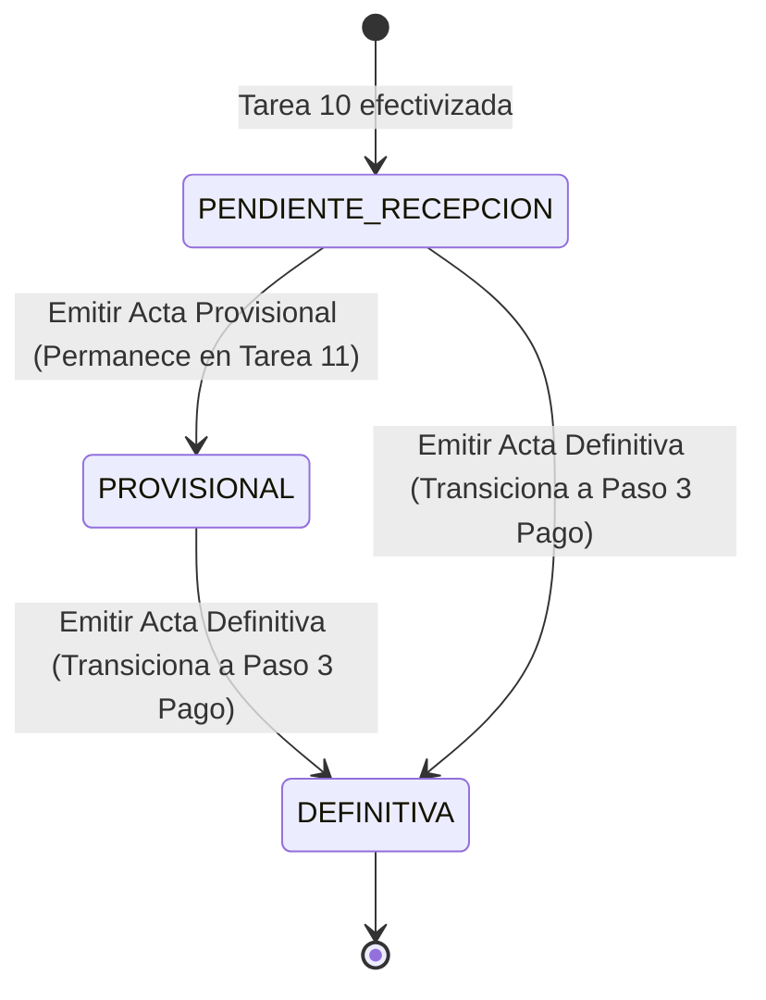

# Data Model: Registro del Acta de Recepción Provisional o Definitiva de Materiales

**Feature**: `011-acta-recepcion-materiales`
**Date**: 2026-07-29

## Database Entities (Supabase / Postgres)

### 1. `acta_recepcion`

Representa el acta física o digital de recepción de materiales de un trámite.

| Campo                  | Tipo           | Nulable | Descripción                                       |
| ---------------------- | -------------- | ------- | ------------------------------------------------- |
| `id`                   | `integer` (PK) | No      | Identificador único                               |
| `id_tramite`           | `integer` (FK) | No      | Referencia al trámite (`tramite.id`)              |
| `id_orden_contractual` | `integer` (FK) | No      | Referencia a `orden_contractual.id`               |
| `tipo_acta`            | `varchar(20)`  | No      | `'PROVISIONAL'`, `'DEFINITIVA'`                   |
| `fecha_recepcion`      | `timestamp`    | No      | Fecha y hora de elaboración                       |
| `nombre_coordinador`   | `text`         | No      | Nombre del Coordinador / Personal de Planta       |
| `nombre_rep_proveedor` | `text`         | No      | Nombre del representante de la empresa proveedora |
| `nombre_rep_bienes`    | `text`         | Sí      | Nombre del representante de Bienes e Inventarios  |
| `factura_url`          | `text`         | Sí      | URL del PDF/imagen de la factura oficial          |
| `evidencia_url`        | `text`         | Sí      | URL de las fotos/evidencias de entrega            |
| `observaciones`        | `text`         | Sí      | Observaciones adicionales de conformidad          |
| `estado`               | `varchar(20)`  | No      | `'PROVISIONAL'`, `'DEFINITIVA'`                   |

### 2. `detalle_acta_recepcion`

Representa la verificación por ítem de material recibido.

| Campo               | Tipo           | Nulable | Descripción                                   |
| ------------------- | -------------- | ------- | --------------------------------------------- |
| `id`                | `integer` (PK) | No      | Identificador único del detalle               |
| `id_acta_recepcion` | `integer` (FK) | No      | Referencia a `acta_recepcion.id`              |
| `id_item_tramite`   | `integer` (FK) | No      | Referencia al ítem del trámite                |
| `cantidad_recibida` | `smallint`     | No      | Cantidad verificada entregada                 |
| `estado_material`   | `varchar(30)`  | No      | `'Excelente'`, `'Bueno'`, `'Con Observación'` |

---

## State Transitions

