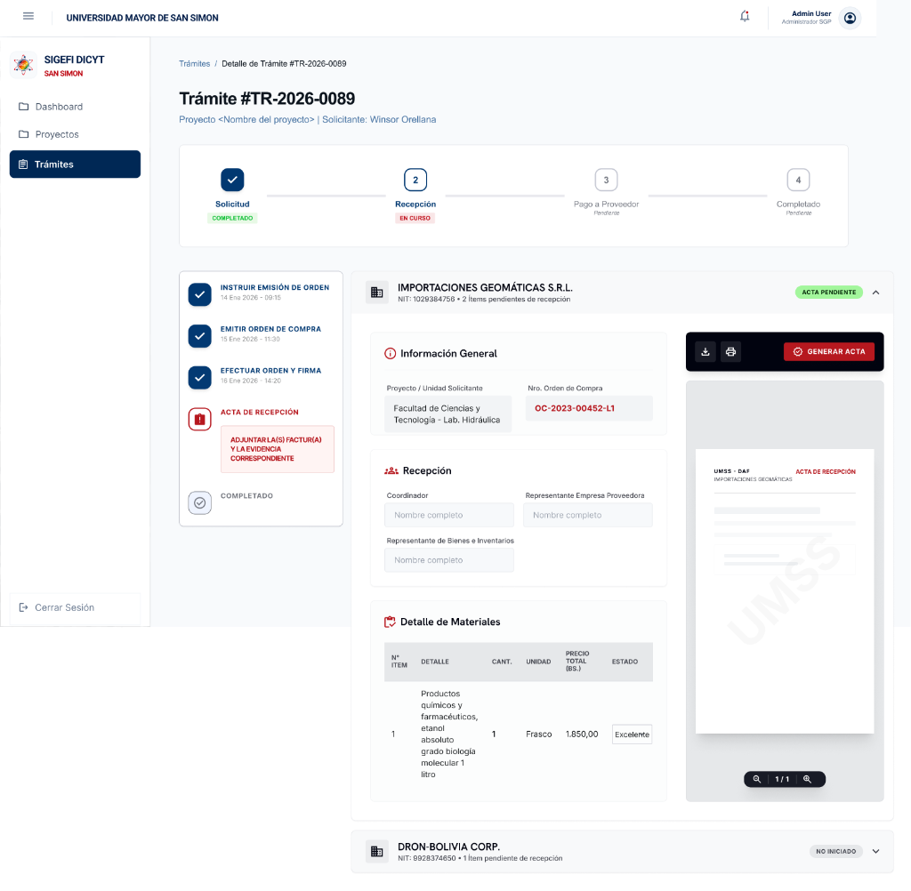

# Feature Specification: Registro del Acta de Recepción Provisional o Definitiva de Materiales

**Feature Branch**: `011-acta-recepcion-materiales`

**Created**: 2026-07-29

**Status**: Draft

**Input**: User description: "Como Investigador Principal o de Apoyo, quiero registrar la recepción de bienes materiales junto con el representante de la empresa proveedora, certificar la conformidad en cantidad y descripción, adjuntar factura/evidencias y emitir el Acta de Recepción Provisional o Definitiva para avanzar el trámite."

## User Scenarios & Testing _(mandatory)_

### User Story 1 - Registro de Conformidad de Materiales y Participantes (Priority: P1)

Como Investigador Principal o Coordinador del Proyecto, quiero registrar los nombres completos de los participantes de la entrega (Coordinador, Representante de la Empresa Proveedora y Representante de Bienes e Inventarios) y verificar en la lista de materiales entregados la cantidad, unidad, detalle y estado de los bienes (ej. "Excelente"), para constatar que todo coincide con el pedido.

**Mockup**: 

**Why this priority**: Es la funcionalidad esencial para certificar la llegada física de los materiales requeridos antes de autorizar cualquier desembolso o pago al proveedor.

**Independent Test**: Cargar la Tarea 11 para un trámite con orden efectivizada y verificar que el sistema muestra la Información General (Proyecto, N° Orden de Compra), los campos para los 3 participantes y la tabla de materiales con selector de estado técnico por ítem.

**Acceptance Scenarios**:

1. **Given** un trámite en etapa de recepción de materiales, **When** el Investigador Principal ingresa a la tarea "Acta de Recepción", **Then** el sistema despliega las tarjetas por proveedor mostrando la Información General (Proyecto/Unidad Solicitante, Nro. Orden de Compra), los campos de texto para registrar al Coordinador, Representante Empresa Proveedora y Representante de Bienes e Inventarios, y la tabla de detalle de materiales entregados.
2. **Given** la tabla de detalle de materiales, **When** el usuario realiza la verificación física, **Then** puede seleccionar el estado del material para cada ítem (ej. "Excelente", "Bueno", "Con Observación").
3. **Given** la fecha de recepción, **When** se evalúa respecto a la fecha límite pactada en la orden, **Then** el sistema verifica que la fecha no sea posterior a la límite o genera una alerta si existe retraso.

---

### User Story 2 - Previsualización y Emisión de Acta (Provisional vs. Definitiva) (Priority: P2)

Como Investigador Principal, quiero previsualizar el documento oficial membretado del "UMSS - DAF ACTA DE RECEPCIÓN" en tiempo real con controles de descarga/impresión, y contar con 2 opciones de decisión: **Emitir Acta Provisional** (para entregas parciales/revisiones) o **Emitir Acta Definitiva** (para certificar recepción 100% conforme y avanzar al Paso 3: Pago a Proveedor).

**Mockup**: 

**Why this priority**: Es indispensable para cumplir con la normativa legal de la UMSS, permitiendo cierres parciales (provisionales) o el pase definitivo al pago administrativo.

**Independent Test**: Hacer clic en "GENERAR ACTA", verificar que el visor PDF de la derecha muestra la plantilla oficial de la UMSS - DAF con datos en vivo, y probar las 2 acciones ("Emitir Acta Provisional" y "Emitir Acta Definitiva").

**Acceptance Scenarios**:

1. **Given** el formulario de recepción completado, **When** el usuario hace clic en "GENERAR ACTA", **Then** el sistema actualiza la vista previa del documento oficial membretado "UMSS - DAF ACTA DE RECEPCIÓN" con el detalle de materiales, firmas y sellos institucionales, habilitando los botones para imprimir y descargar.
2. **Given** la revisión de los materiales recibidos, **When** el usuario presiona **"Emitir Acta de Recepción Provisional"**, **Then** el sistema guarda el registro como `PROVISIONAL`, actualiza el badge a "RECEPCIÓN PROVISIONAL" y mantiene el trámite en la tarea para recepciones posteriores.
3. **Given** la entrega completa y verificada de todos los materiales, **When** el usuario presiona **"Emitir Acta de Recepción Definitiva"**, **Then** el sistema valida que estén adjuntas la factura y evidencias, marca el acta como `DEFINITIVA` y ejecuta la transición al Paso 3 (Pago a Proveedor).

---

### User Story 3 - Carga de Factura del Proveedor y Evidencias Fotográficas (Priority: P3)

Como Investigador Principal, quiero adjuntar la(s) factura(s) emitida(s) por el proveedor y fotografías o evidencias del material recibido para respaldar la rendición administrativa en la DICyT.

**Mockup**: 

**Why this priority**: Garantiza que el expediente digital cuente con el respaldo fiscal (factura) y físico (fotos) necesario para proceder con la orden de pago (C-31 / Cheque).

**Independent Test**: Cargar archivos PDF de la factura y fotos de la entrega en el área de adjuntos y confirmar que quedan registrados en el expediente digital de Supabase.

**Acceptance Scenarios**:

1. **Given** la tarea de recepción en curso, **When** el usuario utiliza la sección de adjuntos, **Then** puede subir el archivo PDF/imagen de la Factura y las fotos de evidencia.
2. **Given** la emisión del Acta Definitiva, **When** el usuario no ha subido la factura, **Then** el sistema bloquea la emisión definitiva y muestra una alerta solicitando adjuntar la factura correspondiente.

---

### Edge Cases

- **¿Qué sucede si la empresa realiza entregas en partidas o lotes separados?**: El sistema permite emitir una o varias **Actas Provisionales** por lote recibido, hasta que se registre la recepción final mediante el **Acta Definitiva**.
- **¿Qué pasa si un material llega dañado o incompleto?**: El usuario marca el estado del ítem como "Con Observación" o "Incompleto" en la tabla, lo cual se refleja en las observaciones del Acta y restringe la emisión a solo Provisional hasta el reemplazo por el proveedor.

## Requirements _(mandatory)_

### Functional Requirements

- **FR-001**: El sistema DEBE cargar automáticamente desde Supabase los datos del proyecto, unidad solicitante, Nro. Orden de Compra y la lista de ítems de materiales adjudicados.
- **FR-002**: El sistema DEBE capturar los nombres completos de los 3 participantes de la entrega: Coordinador del Proyecto, Representante de la Empresa Proveedora y Representante de Bienes e Inventarios.
- **FR-003**: El sistema DEBE permitir asignar el estado de conservación/conformidad técnico para cada ítem de material en la tabla (ej. "Excelente", "Bueno", "Con Observación").
- **FR-004**: El sistema DEBE ofrecer 2 rutas de emisión y transición de workflow:
  1. **Emitir Acta de Recepción Provisional**: Registra la recepción previa/parcial y mantiene el trámite en la Tarea 11.
  2. **Emitir Acta de Recepción Definitiva**: Confirma la recepción 100% conforme, exige factura/evidencia y avanza el trámite al Paso 3 (Pago a Proveedor).
- **FR-005**: El sistema DEBE renderizar en tiempo real un visor de documento para el formulario oficial "UMSS - DAF ACTA DE RECEPCIÓN" con acciones para imprimir, descargar y controles de zoom.
- **FR-006**: El sistema DEBE validar la carga de la Factura oficial (PDF/imagen) y fotografías de evidencia antes de permitir la emisión del Acta Definitiva.
- **FR-007**: El sistema DEBE registrar en el historial de auditoría de Supabase (`historial_estado_tramite`) la generación del acta con sus participantes y tipo (Provisional o Definitiva).

### Key Entities

- **acta_recepcion**: Registro en Supabase (`id`, `id_tramite`, `id_orden_contractual`, `tipo_acta` ['PROVISIONAL' | 'DEFINITIVA'], `fecha_recepcion`, `nombre_coordinador`, `nombre_rep_proveedor`, `nombre_rep_bienes`, `factura_url`, `evidencia_url`, `estado` ['PROVISIONAL' | 'DEFINITIVA']).
- **detalle_acta_recepcion**: Ítems verificados (`id`, `id_acta_recepcion`, `id_item_tramite`, `cantidad_recibida`, `estado_material`).

## Success Criteria _(mandatory)_

### Measurable Outcomes

- **SC-001**: Auto-completado del 100% de los datos del proyecto, orden y lista de ítems sin necesidad de reescribir información previamente registrada.
- **SC-002**: Previsualización instantánea del documento de Acta de Recepción membretado en menos de 1 segundo.
- **SC-003**: Garantía del 100% en la verificación de factura adjunta antes de autorizar el paso al módulo de Pago a Proveedor.

## Assumptions

- Los materiales a recepcionar corresponden a trámites de la categoría "Compra menor de materiales" (PD-73).
- Las firmas físicas finales se estampan sobre la hoja impresa membretada de la UMSS o mediante documento escaneado subido.
