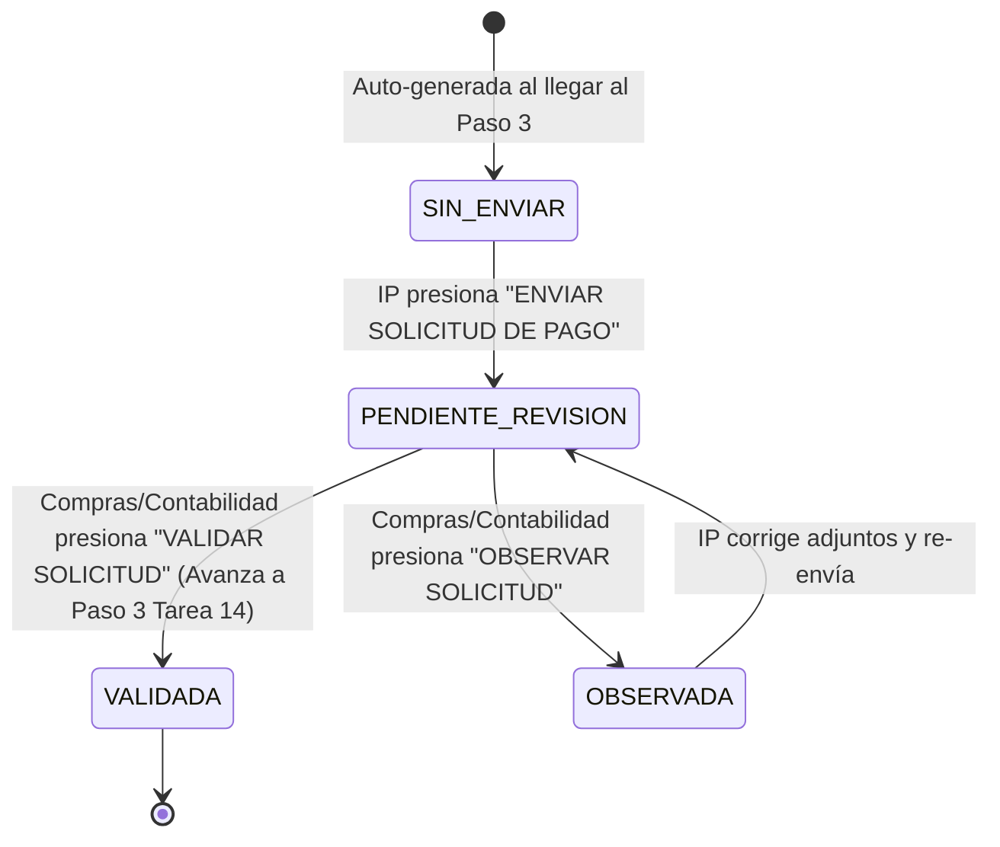

# Data Model: Generación y Envío de Solicitud de Pago a Proveedor

**Feature**: `012-solicitud-pago-proveedor`
**Date**: 2026-07-29

## Database Entities (Supabase / Postgres)

### 1. `solicitud_pago`

Representa la nota de solicitud de pago generada por proveedor adjudicado.

| Campo | Tipo | Nulable | Descripción |
|-------|------|---------|-------------|
| `id` | `integer` (PK) | No | Identificador único de la solicitud |
| `id_tramite` | `integer` (FK) | No | Referencia al trámite (`tramite.id`) |
| `id_orden_contractual` | `integer` (FK) | No | Referencia a `orden_contractual.id` |
| `id_proveedor` | `smallint` (FK) | No | Referencia a `proveedor.id` |
| `numero_solicitud` | `varchar(30)` | Sí | N° correlativo de la solicitud |
| `fecha_solicitud` | `timestamp` | No | Fecha de emisión de la nota |
| `monto_total` | `numeric(12,2)` | No | Monto total a cancelar al proveedor |
| `monto_literal` | `text` | No | Texto en palabras ("SON: OCHO MIL ... 00/100 BOLIVIANOS") |
| `factura_url` | `text` | Sí | URL del PDF de la factura oficial |
| `nota_entrega_url` | `text` | Sí | URL de la nota de entrega |
| `evidencia_extra_url` | `text` | Sí | URL de evidencias adicionales subidas |
| `estado` | `varchar(30)` | No | `'SIN_ENVIAR'`, `'PENDIENTE_REVISION'`, `'VALIDADA'`, `'OBSERVADA'` |
| `motivo_observacion` | `text` | Sí | Razón obligatoria registrada si fue observada |
| `id_usuario_validador` | `integer` (FK) | Sí | Usuario que validó u observó |
| `fecha_validacion` | `timestamp` | Sí | Fecha y hora de validación |

---

## State Transitions

