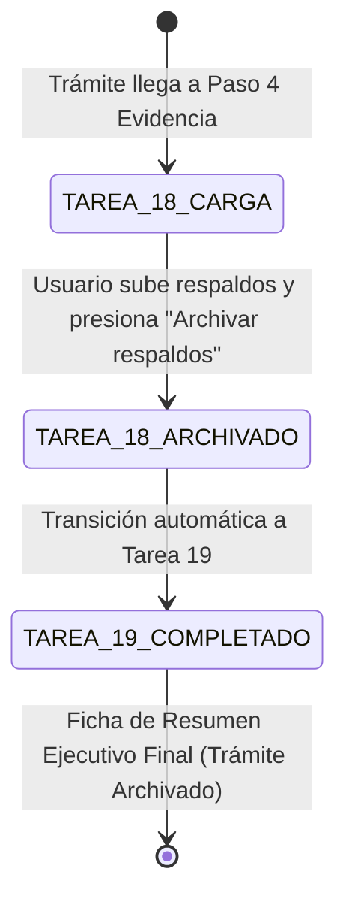

# Data Model: Expediente Digital y Resumen de Trámite Completado

**Feature**: `013-expediente-digital-resumen-completado`
**Date**: 2026-07-29

## Database Entities (Supabase / Postgres)

### 1. `expediente_digital`

Representa los documentos y respaldos almacenados en el expediente digital del trámite.

| Campo | Tipo | Nulable | Descripción |
|-------|------|---------|-------------|
| `id` | `integer` (PK) | No | Identificador único |
| `id_tramite` | `integer` (FK) | No | Referencia a `tramite.id` |
| `nombre_archivo` | `text` | No | Nombre visible del archivo (ej. `Acta_Laptop_Signed.pdf`) |
| `url_archivo` | `text` | No | URL pública o de Supabase Storage |
| `tipo_archivo` | `varchar(20)` | No | `'pdf'`, `'image'`, `'doc'` |
| `tamano_bytes` | `integer` | No | Tamaño del archivo en bytes |
| `categoria` | `varchar(30)` | Sí | `'FACTURA'`, `'ACTA'`, `'NOTA_ENTREGA'`, `'RESPALDO_FINAL'` |
| `fecha_carga` | `timestamp` | No | Fecha y hora de carga |

---

## State Transitions

