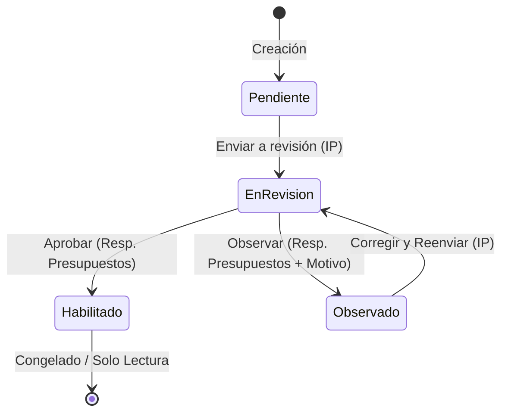

# Data Model & Schema: Revisar Memoria de Cálculo

## Data Entities

### 1. EvaluacionMemoriaCalculo

- **id**: `number` (Primary Key)
- **proyectoId**: `number` (Foreign Key -> Proyecto.id)
- **usuarioId**: `number` (Foreign Key -> Usuario.id)
- **usuarioNombre**: `string` (e.g. "Lic. Roberto Carlos - Responsable Presupuestos")
- **decision**: `"APROBADO" | "OBSERVADO"`
- **motivoObservacion**: `string | null` (Required when decision is `OBSERVADO`)
- **fechaHora**: `string` (ISO timestamp e.g. `2026-07-31T11:45:00Z`)

### 2. Proyecto (State Extension)

- **estado**: `{ id: number; nombre: string }`
  - `1`: "Memoria de cálculo pendiente"
  - `2`: "En revisión de memoria de cálculo"
  - `3`: "Observado"
  - `4`: "Habilitado para ejecutar partidas"
- **ultimaObservacion**: `string | null`
- **permisos**:
  - `puedeDetallarMemoria`: `boolean` (true if estado is 1 or 3)
  - `puedeEvaluar`: `boolean` (true if estado is 2)
  - `soloLectura`: `boolean` (true if estado is 4)

## State Transition Rules

