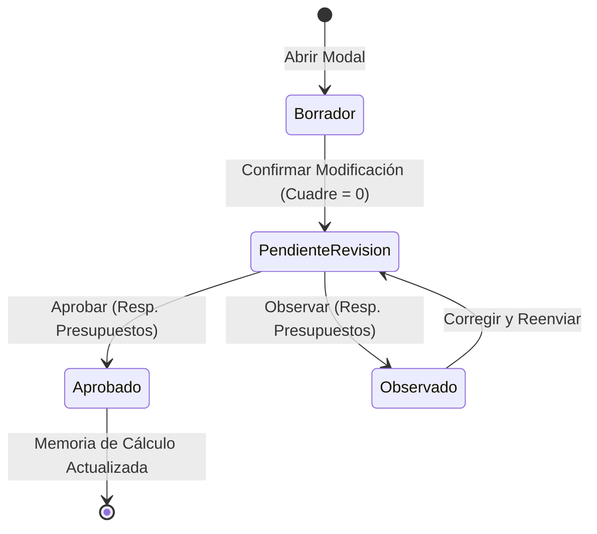

# Data Model & Schema: Modificación Presupuestaria

## Data Entities

### 1. ModificacionPresupuestaria

- **id**: `string` (e.g. "mod-0089")
- **codigoTramite**: `string` (e.g. "#TR-2026-0089")
- **proyectoId**: `number`
- **proyectoNombre**: `string` (e.g. "Investigación y Desarrollo Tecnológico 2024")
- **proyectoCodigo**: `string` (e.g. "PT09FC001")
- **solicitanteId**: `number`
- **solicitanteNombre**: `string` (e.g. "Ing. Iván Méndez Velásquez")
- **fecha**: `string` (ISO date e.g. "2026-07-31")
- **estado**: `"PENDIENTE"` | `"APROBADO"` | `"OBSERVADO"`
- **totalQuitado**: `number`
- **totalAumentado**: `number`
- **balance**: `number` (0 when valid)
- **partidasAfectadas**: `MovimientoPartida[]` (De: partidas de origen)
- **partidasBeneficiadas**: `MovimientoPartida[]` (A: partidas de destino)
- **justificacionCodigos`: `string` (e.g. "De: 31120, 32300, 34600, 39700, 22120 | A: 39100, 39800, 22110, 22210, 23200")
- **justificacionTexto**: `string` (Complementary reason entered by investigator)
- **fechaAprobacion**: `string | null`

### 2. MovimientoPartida

- **id**: `string`
- **partidaId**: `number`
- **codigo**: `string` (e.g. "31120")
- **descripcion**: `string` (e.g. "Alimentación y Similares")
- **saldoActual**: `number`
- **monto**: `number` (positive number for amount removed or added)
- **tipo**: `"QUITAR"` | `"AUMENTAR"`

